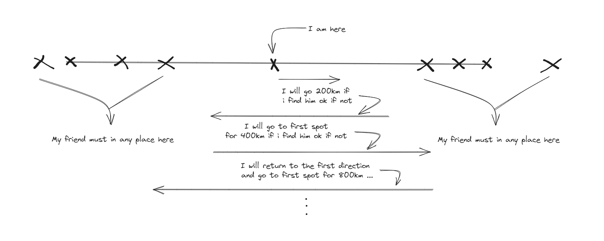

# Logic

I am in the road and i want to find my friend i will go 200 km straight if i don't find hom i will go in the other direction for 400 km if idon't find him i will go in the first direction for 800 km, iwill go in this steps until i find him
